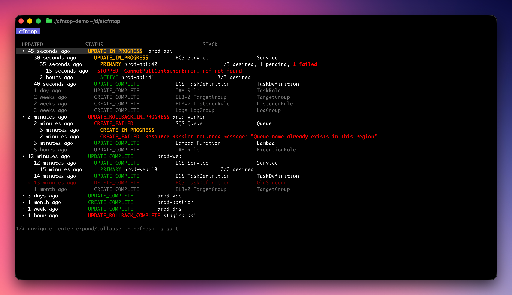

# cfntop

Live TUI monitor for AWS CloudFormation stacks.

Stacks are sorted by last update, with active deployments on top. Expand any stack to see its resources and their current status. ECS services show active deployments with task counts and failed task details.



## Features

- Real-time polling of all CloudFormation stacks in a region
- Active deployments auto-expand and always poll on every cycle
- Recently-updated stacks auto-expand on startup (up to 5, within last 3 hours)
- Expanded inactive stacks refresh once per minute
- ECS service deployments with running/desired/pending/failed task counts
- Failed ECS task details with stop codes and reasons
- Event history for errored resources (scoped to the most recent deploy)
- Recently deleted resources shown with dim styling
- Relative timestamps by default (e.g. "2m ago"), optional absolute mode
- Status color coding: green (complete), yellow (in-progress), red (failed/rollback)

## Install

**Homebrew**
```bash
brew install awesome-foundation/tap/cfntop
```

### macOS (Apple Silicon)

```sh
curl -fsSL https://github.com/awesome-foundation/cfntop/releases/download/x-release-please-version/cfntop_x-release-please-version_darwin_arm64.tar.gz \
  | tar -xz -C ~/.local/bin cfntop
```

### macOS (Intel)

```sh
curl -fsSL https://github.com/awesome-foundation/cfntop/releases/download/x-release-please-version/cfntop_x-release-please-version_darwin_amd64.tar.gz \
  | tar -xz -C ~/.local/bin cfntop
```

### Linux (x86_64)

```sh
curl -fsSL https://github.com/awesome-foundation/cfntop/releases/download/x-release-please-version/cfntop_x-release-please-version_linux_amd64.tar.gz \
  | tar -xz -C ~/.local/bin cfntop
```

### Linux (ARM64)

```sh
curl -fsSL https://github.com/awesome-foundation/cfntop/releases/download/x-release-please-version/cfntop_x-release-please-version_linux_arm64.tar.gz \
  | tar -xz -C ~/.local/bin cfntop
```

### Go install

```sh
go install github.com/awesome-foundation/cfntop/cmd/cfntop@latest
```

> Ensure `~/.local/bin` is on your `PATH`. Add `export PATH="$HOME/.local/bin:$PATH"` to your shell profile if needed.

## Usage

```
cfntop [flags]

Flags:
  -r, --region string     AWS region
  -p, --profile string    AWS profile
  -n, --interval int      Poll interval in seconds (default 5)
      --absolute-time     Show absolute timestamps instead of relative (e.g. 2m ago)
  -h, --help              help for cfntop
      --version           version for cfntop
```

## Keyboard Shortcuts

| Key | Action |
|-----|--------|
| `↑` / `k` | Move cursor up |
| `↓` / `j` | Move cursor down |
| `enter` / `space` | Expand / collapse stack |
| `r` | Force refresh |
| `q` / `ctrl+c` | Quit |

## Permissions

cfntop requires read-only AWS CloudFormation access:

- `cloudformation:ListStacks`
- `cloudformation:ListStackResources`
- `cloudformation:DescribeStackEvents`

For ECS deployment details:

- `ecs:DescribeServices`
- `ecs:ListTasks`
- `ecs:DescribeTasks`
